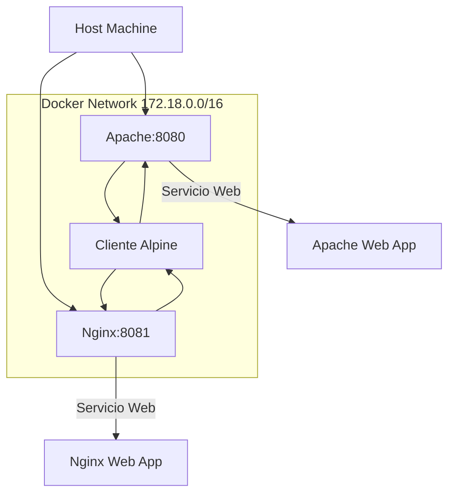

# 🐳 Despliegue de Aplicaciones Web con Docker


Un proyecto académico que demuestra el despliegue profesional de aplicaciones web utilizando contenedores Docker, implementando una arquitectura de red personalizada con múltiples servidores web.

## 🚀 Características Principales

### 🌐 Arquitectura de Red
- **Red personalizada Docker**: `172.18.0.0/16`
- **Servidor Apache**: `172.18.0.2:8080`
- **Servidor Nginx**: `172.18.0.5:8081` 
- **Cliente Alpine**: `172.18.0.3` para pruebas
- **DNS interno** automático entre contenedores

### 🛠️ Stack Tecnológico
- **Docker** + **Docker Compose**
- **Apache HTTP Server** con PHP
- **Nginx** con PHP-FPM
- **Alpine Linux** para cliente de pruebas
- **HTML5**, **CSS3**, **JavaScript**, **PHP**

## 📋 Prerrequisitos

- Docker Engine 20.10+
- Docker Compose 2.0+
- Git (para clonar el repositorio)

## 🏗️ Estructura del Proyecto

```
primerExamenDAW/
├── 📁 html/                    # Archivos web
│   ├── index.php              # Aplicación Apache
│   └── nginx-index.php        # Aplicación Nginx
├── 📄 docker-compose.yml      # Orquestación
├── 📄 Dockerfile.apache       # Imagen Apache
├── 📄 Dockerfile.nginx        # Imagen Nginx
├── 📄 nginx.conf              # Configuración Nginx
└── 📄 README.md              # Documentación
```

## 🚀 Instalación y Ejecución

### 1. Clonar el repositorio
```bash
git clone https://github.com/jesusProgramon/primerExamenDAW.git
cd primerExamenDAW
```

### 2. Desplegar con Docker Compose
```bash
docker compose up -d
```

### 3. Acceder a las aplicaciones
- **Apache Server**: http://localhost:8080
- **Nginx Server**: http://localhost:8081

## 🧪 Verificación del Sistema

### Comprobar contenedores activos
```bash
docker ps
```

### Probar conectividad interna
```bash
docker exec -it cliente-test sh
# Dentro del contenedor:
curl http://servidor-web
curl http://servidor-nginx
nslookup servidor-web
```

### Inspeccionar la red
```bash
docker network inspect red-apache
```

## 🎯 Funcionalidades Implementadas

### ✅ Servidores Web
- **Apache**: Servidor web tradicional con módulo PHP
- **Nginx**: Servidor de alto rendimiento con PHP-FPM
- **Páginas dinámicas** que muestran información del servidor
- **Diseños responsivos** y modernos

### ✅ Red y Conectividad
- Red bridge personalizada `red-apache`
- Asignación estática de IPs
- Resolución DNS interna entre contenedores
- Mapeo de puertos al host

### ✅ Automatización
- Orquestación completa con Docker Compose
- Builds automáticos de imágenes personalizadas
- Volúmenes para desarrollo
- Reinicio automático de contenedores

## 📊 Arquitectura del Sistema



## 🛠️ Comandos Útiles

### Gestión de Contenedores
```bash
# Iniciar servicios
docker compose up -d

# Detener servicios
docker compose down

# Ver logs en tiempo real
docker compose logs -f

# Reconstruir imágenes
docker compose build --no-cache
```

### Desarrollo y Debugging
```bash
# Acceder a contenedores
docker exec -it servidor-web bash
docker exec -it servidor-nginx sh

# Probar conectividad
docker exec cliente-test curl http://servidor-web

# Inspeccionar red
docker network ls
docker network inspect red-apache
```

## 🎨 Características de las Aplicaciones

### Apache Server (`localhost:8080`)
- Diseño con gradientes azules
- Información del servidor en tiempo real
- Animaciones CSS y JavaScript
- Panel de características del servidor

### Nginx Server (`localhost:8081`)
- Diseño con gradientes morados/rosados
- Estadísticas de rendimiento animadas
- Badges de tecnologías utilizadas
- Información técnica del servidor

## 🔧 Personalización

### Modificar aplicaciones web
Edita los archivos en la carpeta `html/`:
- `index.php` - Aplicación para Apache
- `nginx-index.php` - Aplicación para Nginx

### Configuración de red
Modifica `docker-compose.yml` para cambiar:
- Subred y gateway
- IPs estáticas de contenedores
- Puertos mapeados

## 🐛 Solución de Problemas

### Los contenedores no inician
```bash
# Verificar logs
docker compose logs

# Reconstruir imágenes
docker compose build --no-cache
docker compose up -d
```

### Error de permisos
```bash
# Dar permisos a la carpeta html
chmod -R 755 html/
```

### Puerto en uso
```bash
# Cambiar puertos en docker-compose.yml
ports:
  - "8080:80"  # Cambiar 8080 por otro puerto libre
```

## 👨‍💻 Autor

**Jesús Miranda Díaz**  
- 🎓 Estudiante de Despliegue de Aplicaciones Web  
- 📧 [GitHub](https://github.com/jesusProgramon)  


---

<div align="center">

**✨ Desplegado con ❤️ usando Docker ✨**

[⬆ Volver al inicio](#-despliegue-de-aplicaciones-web-con-docker)

</div>
